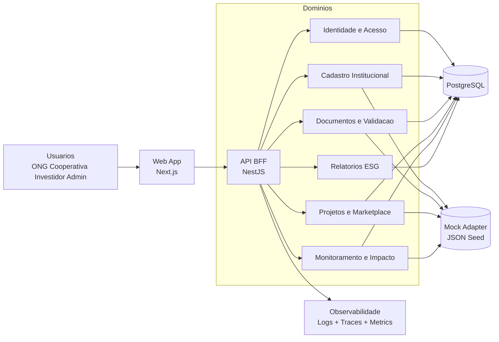

# ONGanizator - Arquitetura Sugerida (MVP com Dados Mock)

## 1. Resumo Executivo

Objetivo: construir uma app de demonstracao para captar financiamento, com experiencia parecida com o portal partners.flexpag.com (dashboard operacional + fluxos de negocio), mas com stack mais atual e arquitetura preparada para evoluir para producao.

Foco do MVP:
- Provar valor para financiadores em 4 a 8 semanas.
- Demonstrar jornada ponta a ponta com dados mock realistas.
- Mostrar governanca, rastreabilidade e monitoramento de impacto.
- Evitar complexidade de microservicos no inicio.

## 2. Problema que o MVP resolve

A plataforma conecta organizacoes sociais, cooperativas, investidores e patrocinadores para:
- onboarding institucional;
- avaliacao de maturidade;
- cadastro e vitrine de projetos;
- monitoramento de impacto e ESG.

O MVP deve provar 3 pontos:
1. Confianca: governanca e validacao institucional.
2. Match: conexao entre projetos e financiadores.
3. Transparencia: indicadores de impacto e trilha de auditoria.

## 3. Escopo recomendado para apresentacao (MVP)

## Modulos incluidos
- Autenticacao e perfis (RBAC basico)
- Cadastro institucional (ONG, cooperativa, negocio social)
- Gestao documental (upload mock, status de validacao)
- Diagnostico de maturidade (questionario + score)
- Cadastro de projetos
- Marketplace com filtros
- Dashboard de impacto (ODS, ESG, metas)

## Modulos adiados (pos-MVP)
- Pagamentos reais (PIX/cartao/boleto)
- OCR e IA de classificacao automatica
- Integracoes externas (Receita, Open Finance, gov.br)
- App mobile nativo

## 4. Arquitetura recomendada (trade-off vencedor)

Recomendacao para MVP: Monolito modular fullstack, com fronteira clara de dominios.

Stack sugerida:
- Frontend: Next.js 15 + React 19 + TypeScript + Tailwind + componente UI padrao
- Backend: NestJS 11 (BFF/API), no mesmo monorepo
- Banco: PostgreSQL + Prisma
- Cache/fila (opcional no MVP): Redis
- Observabilidade: OpenTelemetry + logs estruturados
- Auth: Auth.js (credenciais + OAuth) com RBAC por papel
- Mock strategy: adapters de dados com JSON seedado + Faker para volume

Motivo da escolha:
- entrega rapida para demo;
- UX moderna e performatica;
- arquitetura limpa para migrar de mock para dados reais sem refazer telas;
- menor custo operacional inicial do que microservicos.

## 5. Matriz de trade-off

| Opcao | Time-to-market | Custo inicial | Escalabilidade | Complexidade | Risco MVP |
|---|---|---|---|---|---|
| Next.js fullstack apenas | Muito alta | Muito baixo | Media | Baixa | Baixo |
| Next.js + NestJS (recomendada) | Alta | Baixo | Alta | Media | Baixo |
| Angular + Spring Boot | Media | Medio | Alta | Media | Medio |
| Microservicos desde o inicio | Baixa | Alto | Muito alta | Alta | Alto |

Decisao: Next.js + NestJS em monorepo, com modularizacao por dominio.

## 6. Desenho da arquitetura (alto nivel)

## 7. Estrategia de dados mock (para convencer financiador)

Principios:
- Dados plausiveis, nao sensiveis e anonimizados.
- Massa de dados suficiente para parecer operacao real.
- Cenarios bons e ruins para mostrar capacidade de governanca.

Conjuntos mock recomendados:
- 120 organizacoes (ONG/cooperativa/negocio social)
- 480 projetos (4 por organizacao em media)
- 60 investidores/patrocinadores
- 2.500 eventos de monitoramento (metas, entregas, evidencias)
- 1.200 documentos com status variados (pendente/aprovado/reprovado)

Cenarios de demo:
1. ONG faz onboarding e sobe documentos.
2. Avaliador calcula score de maturidade.
3. Projeto entra no marketplace e recebe match de investidor.
4. Dashboard mostra ODS/ESG e evolucao de metas.

## 8. Jornada da demo (pitch de 10 minutos)

1. Login por perfil (ONG e Investidor).
2. Mostrar score de maturidade institucional.
3. Abrir projeto no marketplace com filtros por ODS, regiao e ticket.
4. Simular interesse/aporte de investidor.
5. Exibir monitoramento do impacto (indicadores antes/depois).
6. Fechar com painel executivo e trilha de auditoria.

## 9. Roadmap objetivo

Fase 0 (Semana 1):
- Setup monorepo, design system, auth e estrutura de dominios.

Fase 1 (Semanas 2-3):
- Cadastro institucional, documentos e diagnostico.

Fase 2 (Semanas 4-5):
- Projetos, marketplace e matching basico.

Fase 3 (Semanas 6-7):
- Dashboard impacto/ESG + observabilidade + refinamento demo.

Fase 4 (Semana 8):
- Storytelling final para financiadores e pacote de apresentacao.

## 10. Arquitetura-alvo apos aprovacao do financiamento

Evolucao natural sem refatoracao drastica:
- separar dominos em servicos (quando houver gargalo real);
- introduzir event bus para trilhas e automacoes;
- plugar pagamentos e integracoes oficiais;
- expandir camada de IA para avaliacao documental.

Resumo final: com essa abordagem, o MVP fica rapido, convincente para o investimento e tecnicamente preparado para escalar sem retrabalho estrutural.
