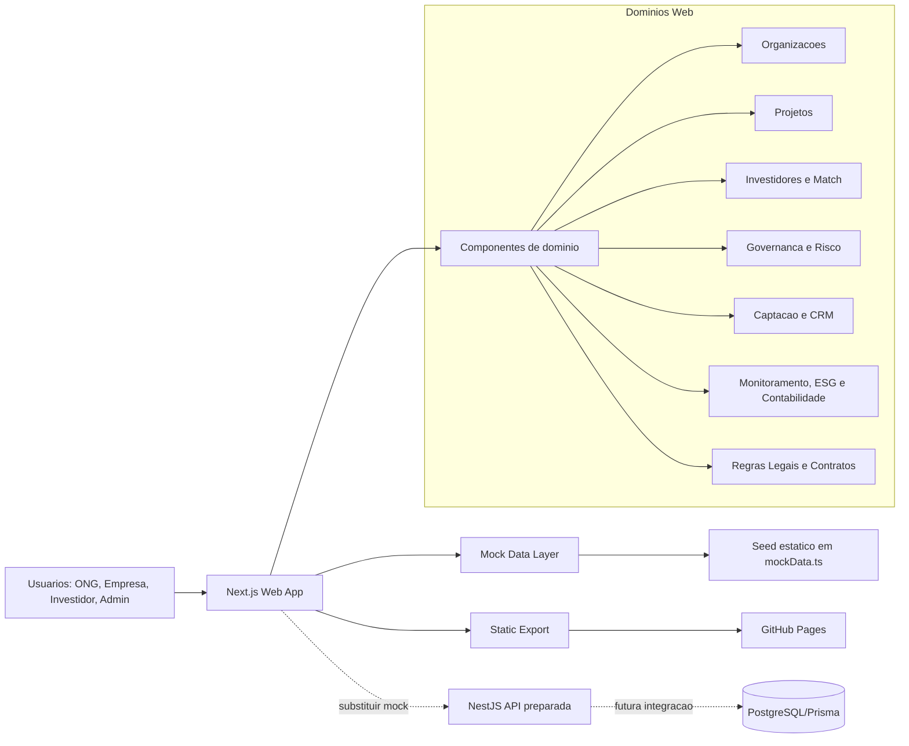
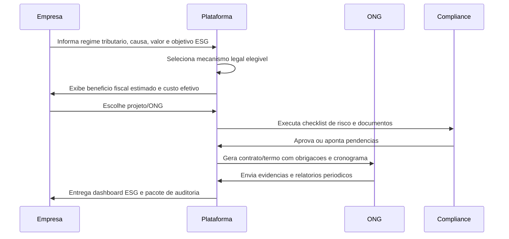

# ONGanizator - Arquitetura e Trade-offs

## 1. Resumo executivo

ONGanizator foi estruturado como monorepo para acelerar a demo e manter um caminho claro para producao. A versao atual prioriza experiencia web, dados mock ricos, export estatico e deploy simples no GitHub Pages.

Objetivos arquiteturais:

- demonstrar a jornada completa ONG -> empresa/investidor -> contrato -> execucao -> evidencias;
- manter rotas estaticas compativeis com GitHub Pages;
- isolar dados em uma camada mock substituivel por API real;
- preparar a evolucao para contratos, regras legais brasileiras, documentos e auditoria.

## 2. Stack atual

| Camada | Tecnologia | Papel |
|---|---|---|
| Monorepo | npm workspaces | Organizar web, API e pacote compartilhado |
| Frontend | Next.js 15.3.3 App Router | UI, rotas, renderizacao estatica |
| React | React 19 | Componentes client/server |
| Linguagem | TypeScript 5 | Tipagem e contratos internos |
| UI | Tailwind CSS 3 | Estilo rapido e consistente |
| API | NestJS 11 | BFF/API preparada para backend real |
| Shared | `packages/shared` | Tipos e contratos compartilhados |
| Deploy | GitHub Actions + GitHub Pages | Build e publicacao automatica |

## 3. Estrutura do monorepo

```text
ONGanizator/
  apps/
    web/                 # Next.js App Router
    api/                 # NestJS API/BFF
  packages/
    shared/              # Tipos e contratos comuns
  .github/workflows/
    deploy.yml           # Deploy GitHub Pages
  BenchMark.md
  Overview.md
  Arquitetura-MVP-Tradeoffs.md
```

## 4. Rotas web atuais

| Rota | Tipo | Descricao |
|---|---|---|
| `/` | Static | Dashboard executivo |
| `/organizacoes` | Static | Lista de organizacoes |
| `/organizacoes/[id]` | SSG | Perfil da organizacao |
| `/organizacoes/[id]/editar` | SSG + client form | Edicao/cadastro de organizacao |
| `/projetos` | Static | Lista de projetos |
| `/projetos/novo` | Client | Cadastro multi-etapa de projeto |
| `/projetos/[id]` | SSG | Detalhe completo do projeto |
| `/projetos/[id]/editar` | SSG + client form | Edicao de projeto |
| `/projetos/[id]/relatorio` | SSG + client form | Relatorio periodico com evidencias |
| `/investidores` | Static | Lista de investidores |
| `/investidores/[id]/editar` | SSG + client form | Edicao/cadastro de investidor |
| `/investidores/[id]/match` | SSG | Motor de match inteligente |
| `/marketplace` | Static | Vitrine de projetos |
| `/crowdfunding` | Static | Campanhas e vaquinhas corporativas |
| `/diagnostico` | Client | Quiz de maturidade institucional |
| `/risco` | Static | Relatorios de risco reputacional |
| `/crm` | Static | CRM de doadores |
| `/mentoria` | Static | Marketplace de mentores |
| `/contabilidade` | Static | DRE e lancamentos |
| `/monitoramento` | Static | Prestacao de contas e indicadores |
| `/impacto` | Static | Impacto & ESG |
| `/para-investidores` | Static | Pagina institucional para investidores |
| `/para-profissionais` | Static | Jornada advogado + contador |
| `/captacao` | Client | Seletor de mecanismo + calculadora fiscal |
| `/crm/lead` | Client | Associacao de financiador a lead |
| `/onboarding` | Client | Onboarding gamificado com selos |
| `/investidores/[id]` | SSG | Detalhe do investidor com projetos compativeis |
| `/projetos/[id]/relatorio/anual` | SSG | Relatorio anual com 11 secoes |
| `/projetos/[id]/auditoria` | SSG | Pacote de auditoria: checklist e trilha |
| `/projetos/[id]/proposta` | SSG | Proposta para patrocinador |
| `/permissoes` | Static | Matriz de permissoes (adm) |
| `/configuracoes` | Client | White-label: logo, cores, fontes, preview |
| `/demo` | Static | Roteiro de demo |

## 5. Desenho de arquitetura atual



## 6. Fronteiras de dominio

| Dominio | Responsabilidades |
|---|---|
| Identidade e acesso | Usuarios, perfis, RBAC, login futuro |
| Organizacoes | Cadastro, dados legais, maturidade, documentos |
| Projetos | Objetivos, metas SMART, orcamento, cronograma, ODS |
| Investidores | Mandato, ticket, regioes, ODS, restricoes |
| Matching | Score por ODS, geografia, ticket, maturidade e tracao |
| Captacao | Marketplace, crowdfunding, CRM e relacionamento |
| Governanca | Diagnostico, risco, compliance, due diligence |
| Contabilidade | Receitas, despesas, DRE, notas e prestacao de contas |
| Impacto | Indicadores, evidencias, timeline, relatorios ESG |
| Legal/Contratos | Marcos legais, calculadora fiscal, termos e auditoria |

## 7. Trade-offs tomados

| Decisao | Beneficio | Custo/Risco | Mitigacao |
|---|---|---|---|
| Next.js com export estatico | Deploy simples e barato no GitHub Pages | Sem SSR/API dinamica em producao estatica | Mock rico e API NestJS preparada |
| Dados em `mockData.ts` | Rapidez para demo executiva | Sem persistencia real | Camada `api.ts` abstrai acesso aos dados |
| Rotas dinamicas com `generateStaticParams` | Compatibilidade com static export | Precisa enumerar ids mock | Server wrapper para forms client |
| Client forms sem persistencia | Demonstra UX sem backend | Dados nao gravam apos refresh | Futuro POST na API NestJS |
| GitHub Pages | Deploy publico rapido | Base path e assets precisam configuracao | `basePath` e `assetPrefix` no Next |
| Monolito modular | Menor complexidade MVP | Pode crescer demais | Separar dominios quando houver escala real |

## 8. Regras tecnicas importantes

1. Rotas dinamicas em `output: 'export'` precisam de `generateStaticParams`.
2. Paginas client que dependem de params devem usar wrapper server + componente client.
3. Dados devem passar pela camada `apps/web/src/lib/api.ts` quando possivel.
4. Mock nao deve conter PII real, credenciais ou documentos sensiveis.
5. Build de producao deve ser validado antes de push/deploy.

## 9. Arquitetura da jornada legal/auditavel



## 10. Evolucao para producao

### Fase 1 - Persistencia real

- PostgreSQL + Prisma.
- Entidades: Organization, Project, Investor, Campaign, Donation, Contract, LegalFramework, Document, Evidence, Report, AccountingEntry.
- Autenticacao com Auth.js ou provedor OAuth.

### Fase 2 - Workflow documental

- Upload seguro de documentos.
- Versionamento.
- Status de validade.
- Checklist por mecanismo legal.
- Assinatura digital.

### Fase 3 - Contratos personalizados

- Templates versionados.
- Campos obrigatorios por mecanismo legal.
- Geracao de PDF.
- Trilha de aceite.
- Hash do documento para auditoria.

### Fase 4 - Integracoes

- Receita/CNPJ e certidoes, quando viavel.
- Provedores de pagamento.
- Assinatura digital.
- ERPs/contabilidade.
- Ferramentas ESG corporativas.

### Fase 5 - IA assistiva

- Classificacao documental.
- Sugestao de mecanismo legal.
- Revisao de contrato.
- Alertas de risco.
- Sumarizacao de evidencias para relatorio ESG.

## 11. Deploy

Workflow atual:

1. Push em `main`.
2. GitHub Actions instala dependencias.
3. Executa `npm run build` em `apps/web`.
4. Gera static export em `apps/web/out`.
5. Publica em `gh-pages` via `peaceiris/actions-gh-pages`.

URL publica esperada:

```text
https://wesleyzilva.github.io/ONGanizator/
```

## 12. Comandos principais

```bash
npm install --workspaces --include-workspace-root --legacy-peer-deps
npm run dev:web
npm run build --workspace=apps/web
```

Resumo: a arquitetura atual e adequada para demonstracao publica e pitch comercial, mantendo um caminho direto para backend real, governanca documental, regras legais brasileiras e auditoria ponta a ponta.
