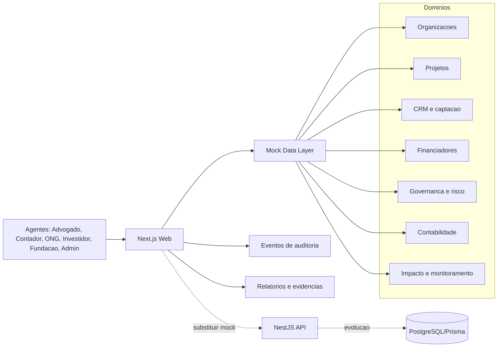

# ONGanizator - Arquitetura do MVP e Trade-offs

## 1. Resumo executivo

O MVP deve provar a jornada auditavel antes de provar escala. A quantidade esperada de usuarios e pequena e o volume de requisicoes nao e significativo. Por isso, a arquitetura deve favorecer clareza de dominio, rastreabilidade e velocidade de demonstracao.

O produto atual esta estruturado como monorepo com web, API preparada e pacote compartilhado. A demo usa dados mock para mostrar fluxos de stakeholder sem depender de banco ou integracoes externas.

## 2. Objetivos arquiteturais

- Demonstrar a jornada advogado -> ONG -> projeto -> financiador -> execucao -> relatorio anual.
- Permitir login e navegacao por perfil de stakeholder.
- Manter trilha auditavel de alteracoes, evidencias, documentos e status.
- Reaproveitar entidades antes de criar novos campos ou tabelas.
- Manter app mock funcional para apresentacao e coleta de feedback.
- Preparar evolucao para persistencia real, contratos, documentos e assinatura digital.

## 3. Stack atual

| Camada | Tecnologia | Papel |
|---|---|---|
| Monorepo | npm workspaces | Organizar web, API e shared |
| Frontend | Next.js 15 App Router | UI, rotas e export estatico |
| React | React 19 | Componentes client/server |
| Linguagem | TypeScript 5 | Tipos e contratos internos |
| UI | Tailwind CSS 3 | Estilo do mock |
| API | NestJS 11 | API/BFF preparada para backend real |
| Shared | `packages/shared` | Tipos compartilhados |
| Deploy | GitHub Actions + GitHub Pages | Publicacao da demo |

## 4. Estrutura do monorepo

```text
ONGanizator/
  apps/
    web/                 # Next.js App Router
    api/                 # NestJS API/BFF preparada
  packages/
    shared/              # Tipos e contratos comuns
  productBacklog/        # RAID log e fontes de prospeccao
  README.md
  Overview.md
  Stakeholders-Agentes.md
  Jornada-Auditavel.md
  Legal-Captacao-ONGs.md
```

## 5. Arquitetura conceitual



## 6. Rotas web atuais

| Rota | Uso na jornada reorganizada |
|---|---|
| `/` | Dashboard executivo e resumo de auditoria |
| `/login` | Entrada por persona mock |
| `/registro` | Criacao de perfil demo |
| `/perfil` | Perspectiva ativa e consentimentos |
| `/organizacoes` | Cadastro e maturidade das ONGs |
| `/organizacoes/[id]` | Perfil institucional e governanca |
| `/projetos` | Lista de projetos e status |
| `/projetos/novo` | Cadastro de projeto pela ONG/advogado |
| `/projetos/[id]` | Detalhe do projeto, KRs e auditoria |
| `/projetos/[id]/relatorio` | Relatorio periodico/anual |
| `/investidores` | Investidores, empresas e fundacoes |
| `/investidores/[id]/match` | Match com projetos |
| `/crm` | Kanban de prospeccao do advogado |
| `/contabilidade` | Lancamentos, saldos e pendencias |
| `/risco` | Risco reputacional e compliance |
| `/monitoramento` | Evidencias, timeline e prestacao de contas |
| `/impacto` | ODS, ESG e indicadores consolidados |
| `/para-investidores` | Pitch para investidores e fundacoes |

## 7. Fronteiras de dominio

| Dominio | Responsabilidade |
|---|---|
| Identidade e acesso | Usuarios, perfis, perspectivas e permissoes |
| Organizacoes | Cadastro, documentos, maturidade e governanca |
| Projetos | Objetivo, KRs, orcamento, cronograma, ODS e status |
| CRM/Captacao | Leads, oportunidades, kanban, semaforo e associacao projeto-financiador |
| Financiadores | Investidores, empresas, fundacoes, mandatos, tickets e restricoes |
| Legal/Compliance | Checklists, termos, pareceres e pendencias juridicas |
| Contabilidade | Receitas, despesas, comprovantes, DRE e conciliacao |
| Auditoria | Eventos, versoes, evidencias, logs e pacote exportavel |
| Impacto | Indicadores, ODS, beneficiarios e relatorios |

## 8. Entidades minimas para evolucao real

Quando sair do mock para persistencia, a primeira modelagem deve partir destas entidades:

- User;
- StakeholderProfile;
- Organization;
- Project;
- ProjectVersion;
- KeyResult;
- InvestorOrFunder;
- FundingOpportunity;
- LegalChecklist;
- AccountingEntry;
- Evidence;
- AuditEvent;
- Report;
- WhiteLabelConfig.

## 9. Trade-offs

| Decisao | Beneficio | Custo/Risco | Mitigacao |
|---|---|---|---|
| Mock rico antes de banco | Rapidez para webinar e feedback | Dados nao persistem | Camada de dados isolada para troca futura |
| Next.js com export estatico | Deploy simples no GitHub Pages | Sem SSR/API dinamica em producao estatica | API NestJS preparada para proxima fase |
| Poucos perfis bem definidos | Jornada clara para demonstracao | Menos flexibilidade generica | Expandir RBAC apos validar fluxo |
| Auditoria por eventos | Rastreabilidade forte | Exige disciplina de modelagem | Eventos minimos documentados em Stakeholders |
| Reaproveitar entidades | Evita crescimento caotico de campos | Pode exigir refatoracao de mock | Criar adaptadores e tipos compartilhados |

## 10. Regras tecnicas importantes

1. Rotas dinamicas em `output: 'export'` precisam de `generateStaticParams`.
2. Paginas client que dependem de params devem usar wrapper server com componente client.
3. Dados devem passar pela camada `apps/web/src/lib/api.ts` quando possivel.
4. Mock nao deve conter documentos sensiveis, credenciais reais ou PII desnecessaria.
5. Cada fluxo novo deve declarar quais eventos de auditoria gera.
6. Antes de criar novo campo, verificar se a informacao cabe em projeto, organizacao, financiador, evidencia, lancamento ou evento.

## 11. Evolucao recomendada

### Fase 1 - Mock alinhado a jornada

- Personas: advogado, contador, ONG, investidor, fundacao e admin.
- Menu por perfil.
- Kanban de prospeccao do advogado.
- Projetos com objetivo, KRs, selos e evidencias.
- Relatorio anual mockado.

### Fase 2 - Persistencia real

- PostgreSQL + Prisma.
- Autenticacao real.
- Upload seguro de documentos.
- AuditEvent persistido.

### Fase 3 - Workflow juridico/contabil

- Checklists por modalidade de captacao.
- Templates de termos/contratos.
- Validacao contabil de comprovantes.
- Exportacao de pacote de auditoria.

### Fase 4 - Integracoes

- Assinatura digital.
- Armazenamento de documentos.
- Consulta CNPJ/certidoes quando viavel.
- ERPs/contabilidade.
- Sistemas ESG de empresas e fundacoes.

## 12. Comandos principais

```bash
npm install --workspaces --include-workspace-root
npm run dev:web
npm run build --workspace=apps/web
```

Resumo: a arquitetura deve continuar simples, porque o desafio do MVP nao e trafego. O desafio e provar uma jornada confiavel, demonstravel e auditavel de ponta a ponta.
